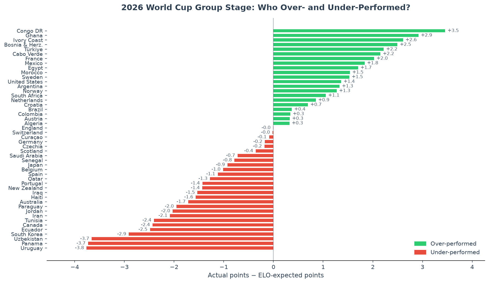
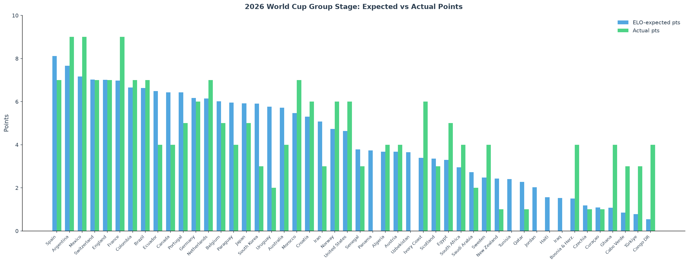
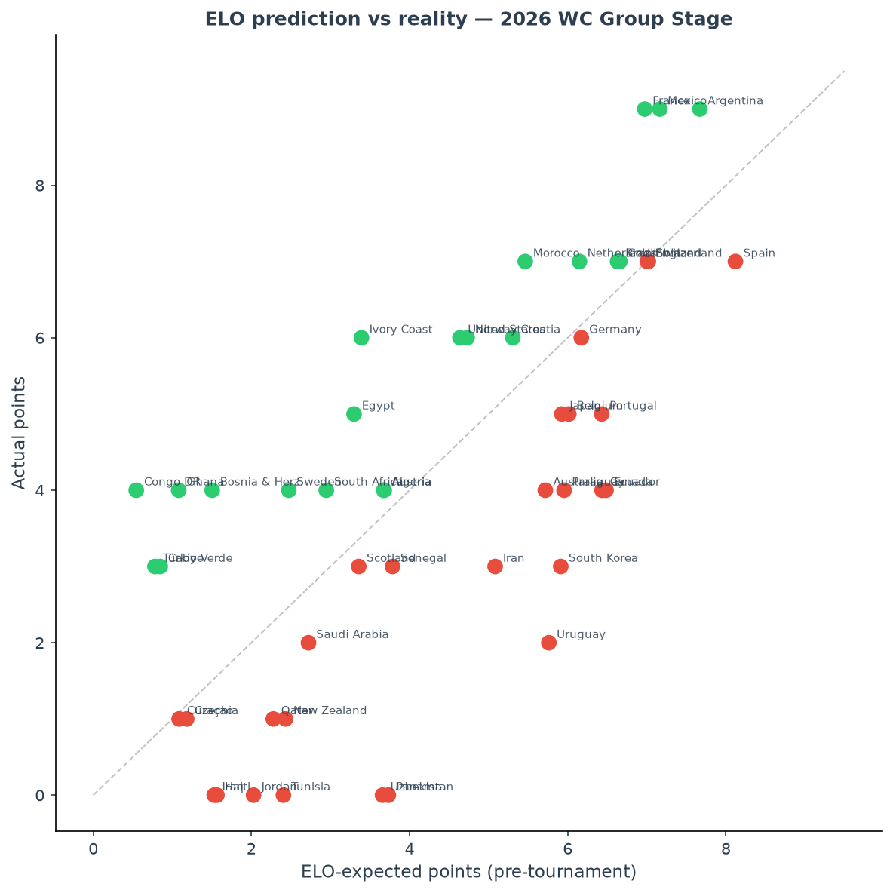

# WC26 ELO — Who Over- and Under-Performed at the 2026 World Cup?

A data pipeline that builds national team ELO ratings from 150 years of international football, then uses them to quantify which teams exceeded or fell short of expectations in the 2026 World Cup group stage.



---

## The Idea

Raw results don't tell you much on their own — beating a weak team is expected. To know whether a result is *surprising*, you need a baseline.

This project builds that baseline from history: bootstrapped 538-style ELO ratings from every international match since 1872. Each team's rating entering the tournament captures their quality across qualifying, friendlies, and previous tournaments. From those ratings, I compute the expected points each team *should* earn across their 3 group games, then compare that to what they actually got.

**Congo DR, Ghana, Ivory Coast** and other historically thin-CV nations produced the biggest positive surprises. **Uruguay, Panama, Uzbekistan** the biggest disappointments. **England** and **Switzerland** landed almost exactly on their ELO-predicted points — as clean a call as this dataset produced.

---

## Method

### ELO model

- **Data:** Kaggle "International Football Results 1872–2026" (~50k matches)
- **Starting rating:** 1500 for all teams (ratings converge after ~20 matches)
- **K-factors by match type:**
  - World Cup: 60
  - Continental championships (Euros, Copa América, AFCON, etc.): 50
  - Qualifiers / Nations League: 40
  - Friendlies: 20
- **Goal margin multiplier:** 1.0 (≤1 goal), 1.5 (2 goals), (11+N)/8 for N>2 goals
- **Home advantage:** +100 ELO points (zero for neutral venues — includes the three co-hosts, USA/Canada/Mexico, treated as neutral for now)
- **Win probability:** standard ELO formula `1 / (1 + 10^(-Δ/400))`

### Expected points

Draw rate isn't constant — it peaks for evenly matched teams and falls for mismatches:

```
W_e = 1 / (1 + 10^(-elo_diff / 400))
p_draw = 0.23 × 4 × W_e × (1 − W_e)
p_win  = W_e − p_draw / 2
p_loss = (1 − W_e) − p_draw / 2
```

`3 × p_win + p_draw`, summed over each team's group games, gives ELO-expected points (`elo_xp`). Ratings are frozen at kickoff — the group stage doesn't feed back into the ratings used to predict it.

---

## Output

Three charts saved to `output/`:

| File | Purpose |
|---|---|
| `hero_overunder.png` | Hero bar chart — over/under-performance ranked by ELO gap. LinkedIn-ready. |
| `comparison.png` | Grouped bars: ELO-xP vs actual, sorted by pre-tournament expectation. |
| `scatter.png` | Scatter: ELO-xP (x) vs actual points (y). Points above diagonal = over-performers. |





---

## Running It

Requires Python 3.12+, [uv](https://docs.astral.sh/uv/), and a Kaggle API token (`~/.kaggle/kaggle.json`).

```sh
# Install dependencies
uv sync

# Run the full pipeline
uv run python main.py
```

---

## Stack

| Layer | Tool |
|---|---|
| Historical data | Kaggle CSV (international football results 1872–2026) |
| WC 2026 match data | FBRef via `soccerdata` |
| ELO computation | Pure Python + pandas |
| Visualisation | `matplotlib` + `seaborn` |

---

## Limitations & Future Extensions

- **xG-expected points** — planned as a second baseline (Poisson-simulated expected points from match xG, to cross-check the ELO signal against in-tournament shot quality) but shelved: FBRef doesn't publish xG for this competition at all. The pipeline still computes an `xg_xp` column and will pick it up automatically if that ever changes.
- **Co-host advantage** — USA, Canada, and Mexico are currently scored as neutral venues despite playing every group game on home soil.
- **No between-tournament ELO regression** — ratings for rarely-active nations can drift a long way from a "current" baseline between appearances.
- **Knockout stage** — the same pipeline extends to single-elimination rounds; expected points there becomes cumulative survival probability rather than a per-game sum.
- Monte Carlo group/bracket simulation, confederation-level breakdowns.
